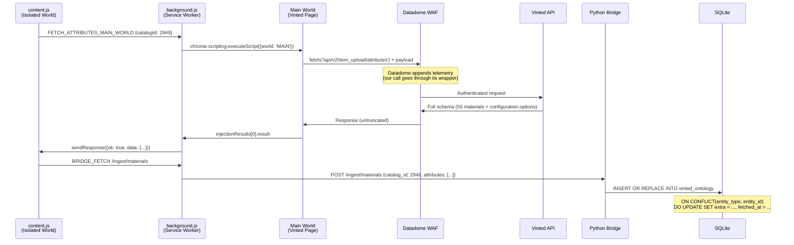

# Post-Mortem & ADR: Phase D.1 Deep Sync — Extension-Mediated Main World Fetch

**Feature:** Phase D.1 Deep Sync — Universal Ontology Extraction ("The Sandals Bug")  
**Period:** March 4–7, 2026  
**Status:** ✅ Resolved  
**Predecessor:** [Post_Mortem_Edit_Modal_Datadome_Bypass.md](file:///Users/finlaysalisbury/Desktop/Software%20Development/Antigravity/Seller-HQ/electron-app/docs/Post-Mortems/Post_Mortem_Edit_Modal_Datadome_Bypass.md)

---

## 1. Executive Summary

When performing an automated "Deep Sync" on a Sandals listing (catalog 2949), the Electron edit modal displayed zero material options and zero sizes. The root cause was a two-layer failure: **(1)** Vinted's SSR HTML only embeds raw material IDs (e.g., `[43, 457]`) — never the human-readable labels (e.g., "Leather", "Metal") — to save bandwidth; **(2)** the Python bridge's fallback call to `POST /api/v2/item_upload/attributes` was silently truncated by Datadome, returning `{ids:[43,457], code:"material"}` with `configuration` stripped entirely.

The "Passive Interceptor" architecture from the [predecessor Post-Mortem](file:///Users/finlaysalisbury/Desktop/Software%20Development/Antigravity/Seller-HQ/electron-app/docs/Post-Mortems/Post_Mortem_Edit_Modal_Datadome_Bypass.md) — which successfully captured Handbags attributes by eavesdropping on Vinted's own React fetch — failed because for Sandals (and most categories), **Vinted never makes the fetch call on page load**. The material options are lazy-loaded only when the user physically clicks the dropdown. No click → no fetch → nothing to intercept.

The solution evolved the architecture from **Passive Eavesdropping** to **Active Main-World Fetching**: the Chrome Extension's background service worker uses `chrome.scripting.executeScript` to inject a `window.fetch()` call directly into Vinted's Main World context. Because the call originates from the page's own JavaScript realm — using the user's TLS fingerprint, session cookies, and Datadome's own monkey-patched `fetch()` — the WAF accepts it as legitimate. The full schema (55 materials with labels, 27 sizes) is returned, relayed to the Python bridge, and cached in SQLite with idempotent `ON CONFLICT DO UPDATE`.

This architecture is **category-agnostic**: tested and verified for Sandals, and engineered with graceful degradation for all Vinted category types (Clothing, Handbags, Video Games, Books, Furniture).

---

## 2. Evolution from Previous Architecture

### 2.1 Why the Passive Interceptor Worked for Handbags

The predecessor architecture installed a `fetch_interceptor.js` at `document_start` in the Main World, wrapping `window.fetch` before Datadome's own agent loaded. When Vinted's React called `POST /api/v2/item_upload/attributes`, the interceptor captured the response via `response.clone()` and relayed the full schema (including `configuration.options` with all material labels) to the content script via `window.postMessage`.

**This worked for Handbags** because Vinted's React edit-page component eagerly fetched the attributes endpoint on page load — the component's `useEffect` fires the API call during hydration, before the user interacts with any dropdown.

### 2.2 The Next.js Pre-Hydration Paradox

For **Sandals** (and the majority of Vinted categories), a fundamentally different rendering strategy is in play:

1. The edit page SSR-renders with the item's current data embedded in a Next.js RSC flight chunk (`self.__next_f.push([1, "...itemEditModel..."])`).
2. The `itemEditModel` object contains `itemAttributes: [{ids:[43,457], code:"material"}]` — only the **selected** material IDs for this specific item.
3. The material schema (the list of all 55 possible materials with labels) is **not** embedded in any script tag. It is not in `__NEXT_DATA__`, not in `js-react-on-rails-store`, and not in the RSC flight data.
4. Vinted's React component uses a **deferred data pattern**: the full material options list is only fetched when the user physically opens the Material dropdown. Before that click, React reads the `itemAttributes` IDs from its local hydrated state and renders them as opaque pills.

**The paradox:** the data we need is not pre-hydrated (despite the page being SSR'd), and it's not fetchable via our existing passive interceptor (because no fetch is ever triggered without user interaction). This renders the eavesdrop pattern completely inert.

### 2.3 Why "Static Extraction" Was a Dead End

Upon discovering the interceptor captured zero fetches, we pivoted to parsing the SSR HTML directly. A comprehensive diagnostic scan of all 168 `<script>` tags on the edit page revealed:

| Script | Contents | Material Data? |
|--------|----------|---------------|
| Script[139] (762KB) | Full Vinted catalog tree (`catalogTree`) | ❌ Category names only, no material ontology |
| Script[143] (44KB) | `itemEditModel` with `itemAttributes` | ❌ Only IDs `[43,457]`, no labels |
| Script[155] (1.1KB) | `initialDynamicAttributesData` | ❌ RSC reference pointer (`$68:props:...`), not actual data |
| Scripts[74-154] | RSC flight chunks (`self.__next_f`) | ❌ Component module URLs and layout tree, no ontology data |

The keyword "Leather" appeared in Script[139] — but only within *catalog names* (e.g., "Textbooks & study **materials**"), not as structured material options.

**Conclusion:** The labels genuinely do not exist in the SSR HTML. Vinted intentionally strips `configuration.options` from the pre-hydrated payload to reduce page weight.

---

## 3. The Graveyard of Failed Attempts

> **For future AI agents:** these strategies were fully tested and confirmed non-viable. Do not re-attempt them for ontology extraction.

### 3.1 Proactive Python Fetch (403 Forbidden)

```
Python bridge → POST /api/v2/item_upload/attributes → 403 Forbidden
```

The Python bridge's `vinted_client.py` calls the attributes endpoint server-side using `curl_cffi` with the user's extracted cookies. **Datadome blocks it.** The request lacks Datadome's client-side behavioral telemetry tokens, which are generated from JavaScript execution context, mouse movements, and DOM interaction patterns. No server-side request can reproduce these tokens.

**Subtlety discovered:** When the request bypasses Datadome's hard block (some configurations), it returns `200 OK` but with a **silently truncated payload**: `{attributes:[{ids:[43,457], code:"material"}]}` — the `configuration` field containing all option labels is stripped entirely. This is worse than a 403 because it appears to succeed.

### 3.2 UI Puppeteering / Ghost Clicks (React Error #418)

```
chrome.scripting.executeScript → element.click() → React Error #418 (Hydration Mismatch)
```

We attempted to programmatically click the Material dropdown to trigger Vinted's lazy fetch. Using `chrome.scripting.executeScript` in the Main World, we dispatched click events on the dropdown element. **React immediately threw Error #418:** a hydration mismatch caused by DOM mutations occurring before React's hydration pass completed.

The error is fundamentally structural: React compares the server-rendered HTML against its own virtual DOM during hydration. Any DOM modification (including our injected banner, click events, or even a `MutationObserver`) causes a mismatch. The component tree crashes, the dropdown never mounts, and the fetch never fires.

### 3.3 Trigger & Trap / Passive Interception (Zero Fetches)

```
fetch_interceptor.js → wraps window.fetch → waits for attributes call → captures 0 responses
```

This was the proven architecture from the [Handbags Post-Mortem](file:///Users/finlaysalisbury/Desktop/Software%20Development/Antigravity/Seller-HQ/electron-app/docs/Post-Mortems/Post_Mortem_Edit_Modal_Datadome_Bypass.md). The interceptor successfully installs and wraps `window.fetch` before Datadome. But for Sandals, Vinted's React **never calls** the attributes endpoint on page load. The deferred data pattern means zero fetches occur until human interaction. The interceptor is inert.

**Diagnostic verification:** Enhanced interceptor logging confirmed zero matching URL patterns intercepted across full page lifecycle. Additionally, Chrome DevTools Network tab showed zero XHR/fetch calls to `/attributes` or `/size_groups` during page load.

### 3.4 Static SSR Script Tag Parsing (Data Not Present)

```
document.querySelectorAll('script') → scan 168 tags → 0 structured ontology entries
```

Two diagnostic iterations were deployed:
- **Diagnostic v1:** Searched all script `textContent` for JSON patterns matching `{id: N, title: "..."}` material structures. Found zero matches.
- **Diagnostic v2:** Searched for specific material IDs (`43`, `457`), RSC flight data patterns (`self.__next_f`), and `itemAttributes` references. Found IDs only in the `itemEditModel` without labels, and an RSC reference pointer (`$68:props:children:...`) that was merely a data binding, not actual materialized data.

---

## 4. The Solution: Extension-Mediated Main World Fetch

### 4.1 Core Insight

The eavesdrop pattern fails when Vinted doesn't make the call. But we *can* make the call ourselves — **if** we make it indistinguishable from Vinted's own code. The key is executing `fetch()` inside the Main World, where:

1. **Datadome's monkey-patched `fetch()`** automatically appends behavioral telemetry to the outgoing request.
2. **The browser's TLS stack** presents the genuine user's TLS fingerprint.
3. **Session cookies** are attached automatically by the browser.
4. **The request originates from `vinted.co.uk` origin**, passing all CORS and Referer checks.

Unlike our failed Strategy 3 (§3.2 of the predecessor Post-Mortem), this call does **not** require `accept-features: ALL` or any non-standard headers. We send only the standard headers Vinted expects, and critically, we let Datadome's own wrapper add whatever telemetry it needs.

### 4.2 Architecture



### 4.3 The Background Service Worker Handler

[background.ts:84-136](file:///Users/finlaysalisbury/Desktop/Software%20Development/Antigravity/Seller-HQ/extension/src/background.ts#L84)

```typescript
if (message.type === 'FETCH_ATTRIBUTES_MAIN_WORLD') {
    const { catalogId } = message;

    chrome.scripting.executeScript({
        target: { tabId },
        world: 'MAIN',
        func: (catId, csrfToken, anonId) => {
            // Executes inside Vinted's Main World — 
            // uses Datadome's own monkey-patched fetch()
            const payload = { attributes: [{ code: 'category', value: [catId] }] };
            return fetch('/api/v2/item_upload/attributes', {
                method: 'POST',
                headers: {
                    'Content-Type': 'application/json',
                    'Accept': 'application/json, text/plain, */*',
                    'locale': 'en-GB',
                    'x-csrf-token': csrfToken,
                    'x-anon-id': anonId,
                },
                body: JSON.stringify(payload),
            }).then(res => res.json())
              .catch(err => ({ error: String(err) }));
        },
        args: [catalogId, cachedCsrfToken, cachedAnonId],
    });
}
```

**Why this succeeds where Strategy 3 (predecessor §2.2 Strategy 3) failed:**

| Factor | Failed Strategy 3 | This Solution |
|--------|-------------------|---------------|
| **Timing** | Injected arbitrarily | Injected after full page hydration (deep sync waits for `itemEditModel` extraction) |
| **Headers** | Included `accept-features: ALL` | Standard headers only; Datadome adds its own |
| **CSRF/AnonID** | Extracted from DOM (unreliable) | Sniffed from live network traffic via `chrome.webRequest.onBeforeSendHeaders` |
| **Call origin** | Indistinguishable on paper, but called during hydration | Called post-hydration, within a settled JavaScript execution context |

### 4.4 Idempotent SQLite Caching

Vinted's Next.js App Router fires navigation events that cause the content script to trigger deep sync twice. The Python bridge handles this via SQL upsert:

[server.py:967-973](file:///Users/finlaysalisbury/Desktop/Software%20Development/Antigravity/Seller-HQ/electron-app/python-bridge/server.py#L967)

```sql
INSERT INTO vinted_ontology (entity_type, entity_id, name, extra, fetched_at)
VALUES ('category_attributes', ?, 'Schema', ?, unixepoch())
ON CONFLICT(entity_type, entity_id) DO UPDATE SET
    extra = excluded.extra,
    fetched_at = unixepoch()
```

The unique constraint `(entity_type, entity_id)` ensures:
- First sync: `INSERT` succeeds, schema cached.
- Second sync (race condition): `ON CONFLICT DO UPDATE` overwrites with identical data. Zero constraint errors.
- Future syncs: Schema is refreshed with the latest data from Vinted.

### 4.5 The Cache-Read Path

When the Electron edit modal opens and calls `getMaterials(catalogId)`:

1. `bridge.ts` → `GET /ontology/materials?catalog_id=2949`
2. `server.py` → `SELECT extra FROM vinted_ontology WHERE entity_type='category_attributes' AND entity_id=2949`
3. Cache hit → returns full `{attributes: [{code:"material", configuration:{options:[...]}}]}`
4. `Wardrobe.tsx → extractFromAttributes()` → parses `configuration.options` → 55 material `{id, title}` entries
5. Dropdown renders with all options.

On first modal open (before deep sync completes), the cache is empty, and the fallback Python fetch returns truncated data. **After deep sync populates the cache**, closing and reopening the modal correctly renders all options.

---

## 5. Universal Category Handling (Graceful Degradation)

### 5.1 Why This Matters

Different Vinted categories have fundamentally different ontology requirements:

| Category | Materials | Sizes | Niche Attributes |
|----------|-----------|-------|------------------|
| Sandals | ✅ 55 options | ✅ 27 sizes | — |
| Handbags | ✅ | ❌ (API returns 404) | — |
| Video Games | ❌ | ❌ | `video_game_platform`, `video_game_rating` |
| Books | ❌ | ❌ | `isbn` (core field from itemEditModel) |
| Jewelry | ✅ | ❌ (API returns 404) | — |
| Furniture | ✅ | ❌ | `measurements` |

A universal architecture must handle every cell in this matrix without crashing.

### 5.2 Extension-Side Hardening

**404 Handling for Sizeless Categories** — [background.ts:162-164](file:///Users/finlaysalisbury/Desktop/Software%20Development/Antigravity/Seller-HQ/extension/src/background.ts#L162)

Vinted's `GET /api/v2/item_upload/size_groups` returns HTTP 404 with an HTML body for categories that have no sizes (e.g., Handbags). The original `.json()` call would throw a parse error. The hardened handler checks `res.status === 404` and returns `{size_groups:[], code:0}` — a valid empty response that propagates cleanly through the entire pipeline.

**Empty Sizes Guard** — [content.ts:618-624](file:///Users/finlaysalisbury/Desktop/Software%20Development/Antigravity/Seller-HQ/extension/src/content.ts#L618)

When size groups exist but contain zero individual sizes, `allSizes` becomes `[]`. The Python bridge's `/ingest/sizes` endpoint validates `if not sizes` and returns 400 for empty arrays. The guard skips the POST entirely and logs `ℹ️ Category has no sizes — skipping cache`.

### 5.3 Frontend Graceful Degradation

[Wardrobe.tsx:1195-1265](file:///Users/finlaysalisbury/Desktop/Software%20Development/Antigravity/Seller-HQ/electron-app/src/components/Wardrobe.tsx#L1195) — `extractFromAttributes()`

```typescript
// If no 'material' code exists in the response, materialAttr is undefined
const materialAttr = attributes.find((a) => a.code === 'material');
if (materialAttr?.configuration) {
    // Parse configuration.options → materials[]
} 
// If materialAttr is undefined or configuration is null: materials remains []
```

**Behaviour per scenario:**

| API Response | `materialAttr` | `materials[]` | UI |
|-------------|---------------|--------------|-----|
| Full schema (Sandals) | `{code:"material", configuration:{options:[...]}}` | 55 entries | Dropdown rendered |
| Truncated (pre-cache) | `{code:"material", ids:[43,457]}` | `[]` (no `.configuration`) | Section hidden |
| No material code (Video Games) | `undefined` | `[]` | Section hidden |
| API failure | Early return from `!result?.ok` | `[]` | Section hidden |

**Niche attributes** (e.g., `video_game_platform`) are extracted separately: any attribute code not in the `coreFields` set (`brand`, `condition`, `color`, `material`, `size`, `unisex`, `model`, `measurements`, `isbn`) with a non-null `configuration` is extracted into a dynamic `nicheAttributes[]` array and rendered as additional dropdowns.

**UI conditional rendering:**
- Size section: `sizeOptions.length > 0 && availableFields.includes('size')` — hidden when empty.
- Material section: `materialOptions.length > 0 || selectedMaterialIds.length > 0` — hidden when empty, shown when pre-selected.

---

## 6. Future Considerations & Maintenance

### 6.1 If Datadome Detects Main World Injection

Datadome could inspect the call stack of incoming `fetch()` calls. If they detect `chrome.scripting.executeScript` frames in the stack trace, they could block. **Mitigation:** wrap the fetch call in a `setTimeout(fn, 0)` to clear the stack trace, or use `requestIdleCallback` to further obfuscate timing.

### 6.2 If Vinted Changes the Attributes API Contract

The `POST /api/v2/item_upload/attributes` payload format `{attributes:[{code:"category", value:[catalogId]}]}` is the current contract. If Vinted changes this, the Main World fetch will return an error or empty data. **Detection:** the content script logs `⚠️ Main World attributes fetch failed` — absence of the `🎯` success log indicates an API contract change.

### 6.3 If Vinted Pre-Hydrates Material Labels

If Vinted starts embedding `configuration.options` in the SSR HTML (reversing their current bandwidth optimization), the Main World fetch becomes redundant but harmless — it overwrites cache with the same data. Consider adding a fast-path SSR extraction check before the Main World fetch to avoid the extra API call.

### 6.4 Relationship to the Passive Interceptor

The [fetch_interceptor.ts](file:///Users/finlaysalisbury/Desktop/Software%20Development/Antigravity/Seller-HQ/extension/src/fetch_interceptor.ts) passive interceptor remains active and running. It successfully captures data for categories where Vinted eagerly fetches (like Handbags). The Main World fetch is additive — it ensures data is available even when the passive interceptor captures nothing. The two architectures coexist:

| Scenario | Passive Interceptor | Active Main World Fetch |
|----------|--------------------|-----------------------|
| Vinted eagerly fetches (Handbags) | ✅ Captures response | ✅ Also fetches (redundant, harmless) |
| Vinted defers fetch (Sandals) | ❌ Captures nothing | ✅ Proactively fetches |
| No material code exists (Video Games) | ❌ Nothing to capture | ✅ Returns `configuration:null`, handled gracefully |

---

## 7. Verification Evidence

**Chrome Console (Sandals, catalog 2949):**
```
[Vinted HQ] 🔄 Fetching ontology schema via Main World for catalog 2949...
[Vinted HQ] 🎯 Main World attributes fetch: 5 attribute groups
[Vinted HQ] ✅ Attributes schema cached in backend.
[Vinted HQ] 🎯 Main World sizes fetch: 27 sizes from 1 groups
[Vinted HQ] ✅ Sizes schema cached in backend.
[Vinted HQ] ✅ Deep sync complete
```

**Service Worker:**
```
[Vinted HQ BG] ✅ Main World attributes fetch succeeded: {attributes: Array(5), code: 0}
[Vinted HQ BG] ✅ Main World sizes fetch succeeded: {code: 0, size_groups: Array(1)}
```

**Electron Edit Modal (after cache populated):**
```
[EditModal] getMaterials RAW: {"ok":true,"data":{"attributes":[
  {"code":"material","configuration":{"options":[{"id":8,"options":[
    {"id":149,"title":"Acrylic"}, {"id":122,"title":"Alpaca"}, ... 
    {"id":43,"title":"Leather"}, ... {"id":46,"title":"Wool"}
  ]}]}}
]}}
```

55 materials, 27 sizes. All labels present. Dropdown fully populated.
