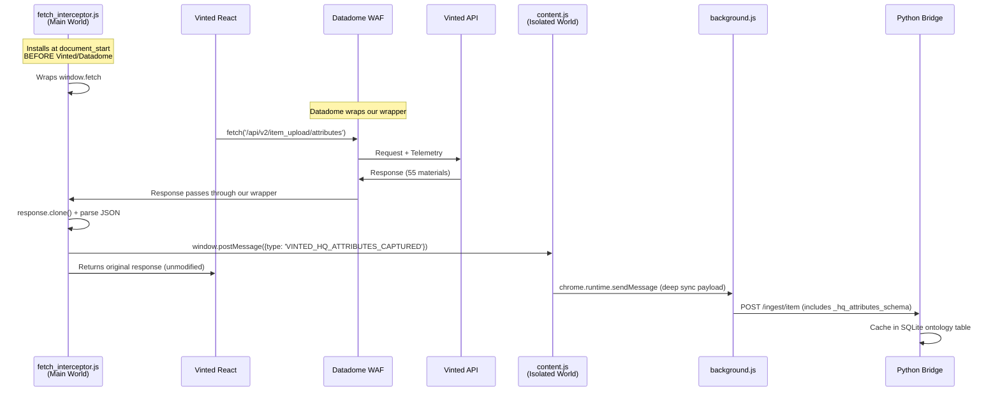

# Post-Mortem & ADR: Vinted Edit Modal — Datadome Bypass via Fetch Interceptor

**Feature:** Vinted Edit Modal & Deep Sync Extension Integration  
**Period:** March 1–3, 2026  
**Status:** ✅ Resolved  

---

## 1. Executive Summary

The Vinted HQ Desktop App's Edit Modal required dynamic material attributes from Vinted's `POST /api/v2/item_upload/attributes` endpoint. All direct request strategies — Python `curl_cffi`, Chrome Extension Isolated World [fetch()](file:///Users/finlaysalisbury/Desktop/Software%20Development/Antigravity/Vinted-HQ/extension/src/fetch_interceptor.ts#18-46), and Main World `chrome.scripting.executeScript` — were defeated by Datadome's WAF, which either returned `403 Forbidden` or silently served empty `attributes: []` payloads.

The solution was an **eavesdrop architecture**: a Main World script injected at `document_start` wraps `window.fetch` before Vinted or Datadome code executes, intercepts Vinted's own React-initiated API responses via `response.clone()`, and relays the captured JSON to the extension via `window.postMessage`. **Zero independent API calls are made.** This successfully extracted all 55 material options.

---

## 2. The Problem (Technical Deep Dive)

### 2.1 The Target Endpoint

Vinted treats materials as dynamic "attributes" tied to a category. To populate the Edit Modal's material dropdown, we need:

```
POST https://www.vinted.co.uk/api/v2/item_upload/attributes
Body: {"attributes": [{"code": "category", "value": [158]}]}
```

When Vinted's own React frontend calls this, it returns a full schema with 5 attribute objects (unisex, brand, condition, color, material), where `material.configuration.options` contains 55 material entries.

### 2.2 Why Every Direct Request Strategy Failed

#### Strategy 1: Python Bridge (`curl_cffi`)

The Python bridge sent POST requests using `curl_cffi` with spoofed TLS fingerprints, cookies, and headers extracted during login. **Result: `403 Forbidden`.**

Datadome's WAF validates requests against a behavioral telemetry signature. The `curl_cffi` request lacked the encrypted telemetry tokens that Datadome's client-side JavaScript agent appends to every browser-initiated request. No amount of header replication can reproduce this server-side without executing Datadome's JS.

#### Strategy 2: Content Script Isolated World [fetch()](file:///Users/finlaysalisbury/Desktop/Software%20Development/Antigravity/Vinted-HQ/extension/src/fetch_interceptor.ts#18-46)

The Chrome Extension's content script called [fetch()](file:///Users/finlaysalisbury/Desktop/Software%20Development/Antigravity/Vinted-HQ/extension/src/fetch_interceptor.ts#18-46) with `credentials: 'include'` directly on `vinted.co.uk`. Cookies were attached correctly, CSRF tokens were sniffed from live traffic via `chrome.webRequest`. **Result: `200 OK` with `{"attributes": []}`** — silently empty.

Chrome Extension content scripts execute in an **Isolated World** — a separate JavaScript execution context from the page's Main World. Datadome monkey-patches `window.fetch` in the Main World to append encrypted telemetry. The Isolated World uses Chrome's pristine, unpatched [fetch()](file:///Users/finlaysalisbury/Desktop/Software%20Development/Antigravity/Vinted-HQ/extension/src/fetch_interceptor.ts#18-46), producing requests that arrive at Vinted's server correctly formatted but *without* Datadome's expected client-side telemetry. Datadome silently sanitizes the response.

#### Strategy 3: Main World `chrome.scripting.executeScript`

We injected a fetch call into the Main World using `chrome.scripting.executeScript({ world: 'MAIN' })`. **Results were inconsistent:**

| Headers Sent | Response |
|---|---|
| Without `accept-features: ALL` | `200 OK`, empty `attributes: []` |
| With `accept-features: ALL` | `403 access_denied` |

The `accept-features: ALL` header routes the request to a stricter backend validation path. Our injected [fetch()](file:///Users/finlaysalisbury/Desktop/Software%20Development/Antigravity/Vinted-HQ/extension/src/fetch_interceptor.ts#18-46) lacked the exact synchronous event-loop trace Datadome expects (it wasn't triggered by a trusted React component interaction). Datadome's stack-trace fingerprinting detected the anomaly and issued either a silent scrub or a hard block.

### 2.3 The CSRF Token Was Not the Problem

Initial debugging focussed heavily on CSRF token extraction — from `<meta>` tags, `__NEXT_DATA__`, `window.vinted.csrfToken`, and cookie decoding. **This was a red herring.** Vinted uses session-scoped CSRF tokens (Rails-style, XOR-masked per render but valid for the full session). The 403s were Datadome behavioral blocks, not CSRF validation failures.

---

## 3. The Solution: The Fetch Interceptor Pattern

### 3.1 Core Principle

Instead of generating our own API calls (which Datadome can fingerprint), we let Vinted's authenticated React code make the request with perfect telemetry, and we **eavesdrop on the response**.

### 3.2 Architecture



### 3.3 The Interceptor Script

[fetch_interceptor.ts](file:///Users/finlaysalisbury/Desktop/Software Development/Antigravity/Vinted-HQ/extension/src/fetch_interceptor.ts)

```typescript
(function () {
    const originalFetch = window.fetch;

    window.fetch = async function (...args) {
        const response = await originalFetch.apply(this, args);
        const url = typeof args[0] === 'string' ? args[0] : args[0]?.url || '';

        if (url.includes('/api/v2/item_upload/attributes')) {
            const clone = response.clone();
            const data = await clone.json();
            window.postMessage({
                type: 'VINTED_HQ_ATTRIBUTES_CAPTURED',
                payload: data,
            }, '*');
        }

        return response; // Unmodified for React
    };
})();
```

**Critical design choices:**
- **`response.clone()`**: Responses are `ReadableStream` — consuming `.json()` consumes the stream. `clone()` creates an independent copy, leaving React's stream intact.
- **`document_start` timing**: The wrapper installs before Datadome's own monkey-patch. When Datadome subsequently wraps `window.fetch`, it wraps *our* wrapper. The call chain becomes: `React → Datadome (adds telemetry) → Our Wrapper (clones response) → Native fetch`.
- **`window.postMessage('*')`**: The only cross-context communication available between Main World and Isolated World. Origin validation (`event.source !== window`) prevents spoofing.

### 3.4 The Content Script Listener

[content.ts](file:///Users/finlaysalisbury/Desktop/Software Development/Antigravity/Vinted-HQ/extension/src/content.ts)

```typescript
let capturedAttributes: any = null;
window.addEventListener('message', (event) => {
    if (event.source !== window) return;
    if (event.data?.type === 'VINTED_HQ_ATTRIBUTES_CAPTURED') {
        capturedAttributes = event.data.payload;
    }
});
```

During deep sync, the content script waits up to 8 seconds for the intercepted data before proceeding. If Vinted's React has already called the endpoint (e.g., during page load), the data is immediately available.

---

## 4. Implementation Details

### Files Modified / Created

| File | Change | Role |
|---|---|---|
| [fetch_interceptor.ts](file:///Users/finlaysalisbury/Desktop/Software Development/Antigravity/Vinted-HQ/extension/src/fetch_interceptor.ts) | **[NEW]** | Main World fetch wrapper, intercepts attribute responses |
| [manifest.json](file:///Users/finlaysalisbury/Desktop/Software Development/Antigravity/Vinted-HQ/extension/public/manifest.json) | Modified | Added dual `content_scripts` entries: Main World (`document_start`) + Isolated World (`document_end`) |
| [vite.config.ts](file:///Users/finlaysalisbury/Desktop/Software Development/Antigravity/Vinted-HQ/extension/vite.config.ts) | Modified | Added `fetch_interceptor` as a build entry point |
| [content.ts](file:///Users/finlaysalisbury/Desktop/Software Development/Antigravity/Vinted-HQ/extension/src/content.ts) | Modified | Added `postMessage` listener, replaced direct fetch with interceptor-based capture |
| [background.ts](file:///Users/finlaysalisbury/Desktop/Software Development/Antigravity/Vinted-HQ/extension/src/background.ts) | Modified | Added `webRequest` header sniffer, `FETCH_ATTRIBUTES_MAIN_WORLD` handler (legacy, now unused) |
| [vinted_client.py](file:///Users/finlaysalisbury/Desktop/Software Development/Antigravity/Vinted-HQ/electron-app/python-bridge/vinted_client.py) | Modified | Corrected [fetch_ontology_materials](file:///Users/finlaysalisbury/Desktop/Software%20Development/Antigravity/Vinted-HQ/electron-app/python-bridge/vinted_client.py#730-773) payload format ([category](file:///Users/finlaysalisbury/Desktop/Software%20Development/Antigravity/Vinted-HQ/electron-app/src/main/inventoryDb.ts#611-640)/`value` schema) |

### Manifest Content Scripts Configuration

```json
"content_scripts": [
    {
        "matches": ["https://www.vinted.co.uk/*"],
        "js": ["fetch_interceptor.js"],
        "run_at": "document_start",
        "world": "MAIN"
    },
    {
        "matches": ["https://www.vinted.co.uk/*"],
        "js": ["content.js"],
        "run_at": "document_end"
    }
]
```

---

## 5. Future Considerations & Maintenance

### 5.1 If Vinted Changes the Endpoint URL
The interceptor matches on `url.includes('/api/v2/item_upload/attributes')`. If Vinted renames or versions this endpoint, update the string match in [fetch_interceptor.ts](file:///Users/finlaysalisbury/Desktop/Software%20Development/Antigravity/Vinted-HQ/extension/src/fetch_interceptor.ts).

### 5.2 If Vinted Encrypts Response Payloads
If Vinted starts encrypting API response bodies (unlikely for a frontend SPA), the `clone.json()` call would fail. Fallback: extract material data directly from the React Fiber tree via `__reactFiber$` DOM property traversal.

### 5.3 If Datadome Detects the Wrapper
Datadome could detect `window.fetch` being wrapped before its own agent loads (by checking `fetch.toString()` or prototype chain). Mitigation: use [Proxy](file:///Users/finlaysalisbury/Desktop/Software%20Development/Antigravity/Vinted-HQ/electron-app/src/preload.ts#150-151) instead of direct assignment, which is transparent to `toString()` checks.

### 5.4 If Vinted Stops Calling the Attributes Endpoint on Page Load
The interceptor is passive — it only captures data when Vinted's React code naturally calls the endpoint. If Vinted moves to a different hydration strategy (e.g., embedding attributes in SSR HTML or `__NEXT_DATA__`), the interceptor would capture nothing. Fallback: parse the `data-js-react-on-rails-store="MainStore"` script tag for pre-hydrated ontology data.

### 5.5 Monitoring
The console logs `[Vinted HQ Interceptor] 🎯 Captured attributes response` when a successful interception occurs. Absence of this log on edit pages indicates Vinted has changed its request pattern.
