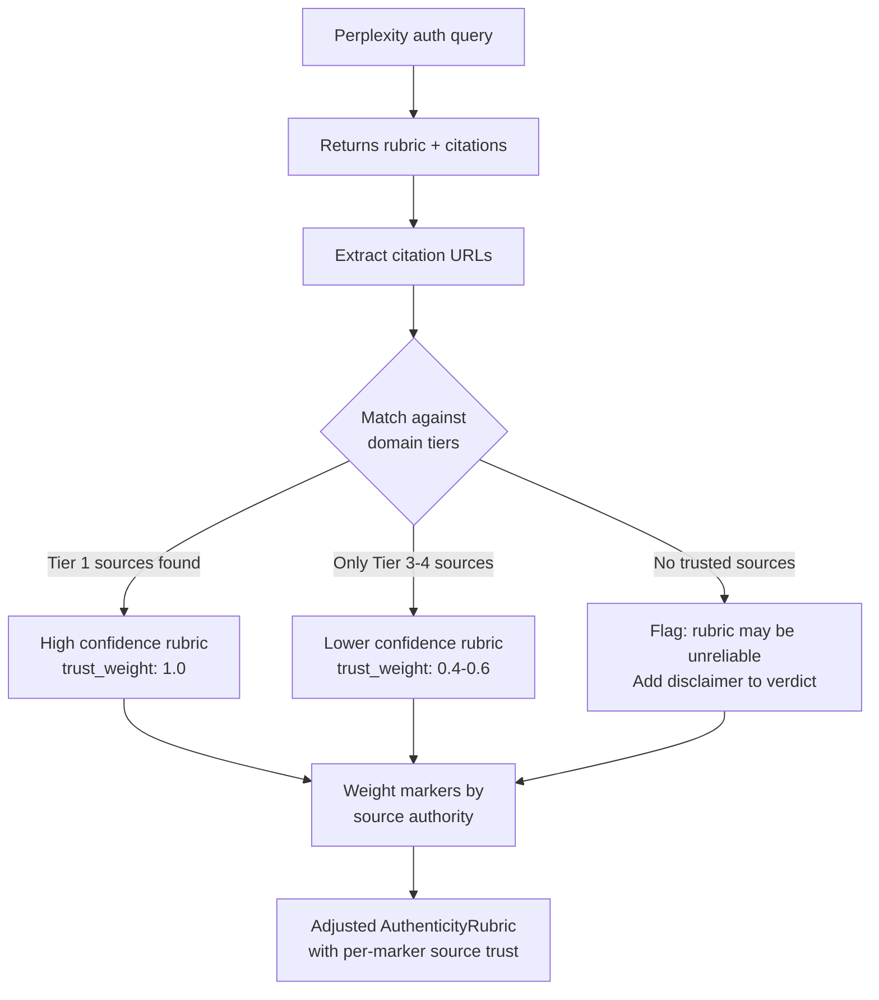
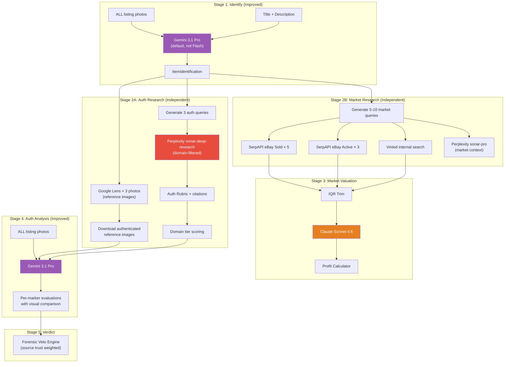

# Cost, Time & Advanced Improvements Analysis

---

## 1. Cost & Time Impact Per Improvement

### API Pricing Reference

| Service | Model | Input (per 1M) | Output (per 1M) | Notes |
|---|---|---|---|---|
| Gemini | 3 Flash | $0.50 | $3.00 | Current Stage 1 |
| Gemini | 3.1 Pro | $2.00 | $12.00 | **4× more** than Flash |
| Perplexity | sonar-pro | $3.00 | $15.00 | Current Stage 2 |
| Perplexity | sonar-deep-research | $2.00 | $8.00 | + $5/1K searches + reasoning |
| Anthropic | Claude Sonnet 4.6 | $3.00 | $15.00 | Stage 3 market analysis |
| SerpAPI | All engines | — | — | ~$0.01-0.025/search (subscription) |

### Typical Token Usage Per Analysis (estimated)

A typical listing analysis with 10 photos:
- ~15,000 input tokens per Gemini call (images + prompt)
- ~500-1,000 output tokens per response
- ~2,000 input / ~2,000 output for Perplexity
- ~3,000 input / ~1,500 output for Claude

### Per-Improvement Cost & Time Breakdown

| # | Improvement | Current Cost | New Cost | Cost Delta | Time Impact |
|---|---|---|---|---|---|
| 1 | **All photos → Stage 1** (10 vs 5) | ~$0.008 | ~$0.015 | +$0.007 | +1-2s (download) |
| 2 | **3.1 Pro default** (replace Flash at Stage 1) | ~$0.008 | ~$0.032 | +$0.024 | +3-5s (deeper reasoning) |
| 3 | **Reference image injection** (3-5 reference imgs to Agent 4) | $0.00 | ~$0.04 | +$0.04 | +5-8s (Lens + download + larger prompt) |
| 4 | **Move Lens to Stage 4** (was Stage 1) | ~$0.02 | $0.02 | $0.00 | Net zero (moved, not added) |
| 5 | **sonar-deep-research** (replace sonar-pro for auth) | ~$0.05 | ~$0.15-0.40 | +$0.10-0.35 | +15-30s (agentic multi-search) |
| 6 | **Domain filtering** (system prompt tuning) | $0.00 | $0.00 | $0.00 | +0s |
| 7 | **Split auth/market pipelines** | $0.05 | ~$0.07 | +$0.02 | +0s (already parallel) |
| 8 | **Cross-validate identification** (Lens at Stage 2) | $0.00 | ~$0.02 | +$0.02 | +3-5s |
| 9 | **Update Claude** to Sonnet 4.6 | Same | Same | $0.00 | +0s |
| 10 | **Multi-query search** (5-10 queries vs 1) | ~$0.03 | ~$0.08 | +$0.05 | +3-5s (parallel) |
| 11 | **Confidence validation** | $0.00 | ~$0.01 | +$0.01 | +1-2s |

### Total Per-Analysis Cost Comparison

| Pipeline | Cost per analysis | Time |
|---|---|---|
| **Current** | ~£0.10-0.15 | ~30-50s |
| **Improved (all changes)** | ~£0.30-0.60 | ~60-90s |
| **Improved (without deep-research)** | ~£0.15-0.25 | ~45-60s |

> [!TIP]
> The biggest cost driver is `sonar-deep-research` (+£0.10-0.35 per analysis). Using it **only for high-value items** (e.g. listed > £200) keeps costs manageable while maintaining quality where it matters.

---

## 2. Market Research — How It's Impacted

### Stages Changed by Improvements

| Stage | Market Research Change | Impact |
|---|---|---|
| **Stage 1** | More photos + Pro model = better identification | Better search queries → more relevant price comparisons |
| **Stage 2** | Multi-query search + dedicated market Perplexity call | Wider price coverage, variant-specific pricing |
| **Stage 3** | Updated Claude Sonnet 4.6 + richer IQR data | Smarter reasoning, better positioning analysis |
| **Stage 5** (new) | Platform-specific profit recalculation | More accurate fee structures |

### Specific Market Research Improvements

**Current weakness**: A single search query "Chanel Wild Stitch Boston Bag Brown" may miss size/condition variants and colour differences.

**Proposed improvements**:

1. **Multi-query eBay searches** (see Q3 below): Different queries capture different price segments
2. **Dedicated Perplexity market call**: Instead of sharing one prompt between auth+market, use a market-specific prompt that asks for:
   - Retail price by variant (colour, size, hardware)
   - Seasonal demand patterns
   - Platform-specific pricing differences (Vinted vs eBay vs Vestiaire)
   - Recent price trends (rising/declining)
3. **Vinted internal search**: Use existing Vinted session to search for comparable items directly
4. **More IQR data points**: More queries = more sold prices = tighter statistical analysis

**Cost impact for market improvements specifically**:

| Change | Extra cost | Extra time |
|---|---|---|
| Multi-query eBay (5 queries × 2 = 10 SerpAPI calls) | +$0.05-0.10 | +3-5s (parallel) |
| Dedicated Perplexity market context | +$0.02 | +0s (already parallel) |
| Updated Claude Sonnet 4.6 | $0.00 | +0s |
| **Total market impact** | **+$0.07-0.12** | **+3-5s** |

---

## 3. Multi-Query Search Strategy

You're absolutely right that one query is too shallow. Here's the proposed multi-query approach:

### Query Generation from Agent 1's Output

Given identification: `Chanel Wild Stitch Boston Bag, Brown, Caviar Leather, 40cm`

**Generate these query variations automatically:**

```
AUTH QUERIES (for Perplexity):
1. "How to authenticate Chanel Wild Stitch Boston Bag"
2. "Chanel Wild Stitch Boston Bag real vs fake"
3. "Chanel Wild Stitch authenticity markers serial number"

MARKET QUERIES (for SerpAPI eBay):
1. "Chanel Wild Stitch Boston Bag" (exact model)
2. "Chanel Wild Stitch Brown Caviar" (specific variant)
3. "Chanel Wild Stitch Bag" (broader, catches different colours)
4. "Chanel Boston Bag Caviar Leather" (material-focused)
5. "Chanel Wild Stitch" (broadest, catches all variants)

REFERENCE IMAGE QUERIES (for Google Lens/Search):
1. "Chanel Wild Stitch Boston Bag authentic" (reference images)
2. Google Lens reverse image search on listing photo 1
3. Google Lens reverse image search on listing photo 2 (different angle)
```

**Why this works**: Different queries capture different sellers' listing styles. Seller A lists as "Chanel Wild Stitch Boston," Seller B lists as "Chanel Caviar Leather Bag Wild Stitch." You need both to get a complete price picture.

**Cost**: Each SerpAPI call is ~$0.01-0.025. 10 queries = ~$0.10-0.25. All run in parallel so time impact is minimal (+3-5s total, not 10×).

---

## 4. Domain Authority Ranking for Auth Check

### Implementation Approach

Build a **tiered authority system** that prioritises the most reputable sources:

```python
AUTH_DOMAIN_TIERS = {
    "tier_1": {
        "description": "Gold-standard authentication authorities",
        "domains": [
            "entrupy.com",
            "realauthentication.com",
            "lollipuff.com",
            "thepursequeen.com",
            "closetfullofcash.com",
        ],
        "trust_weight": 1.0,
    },
    "tier_2": {
        "description": "Established resale platforms with authentication teams",
        "domains": [
            "vestiairecollective.com",
            "therealreal.com",
            "rebag.com",
            "fashionphile.com",
            "yoogiscloset.com",
        ],
        "trust_weight": 0.8,
    },
    "tier_3": {
        "description": "Expert blogs and community forums",
        "domains": [
            "purseforum.com",
            "reddit.com/r/RepLadies",
            "reddit.com/r/DesignerReps",
            "byvanie.co",
        ],
        "trust_weight": 0.6,
    },
    "tier_4": {
        "description": "General fashion/luxury media",
        "domains": [
            "purseblog.com",
            "bagaholicboy.com",
            "buro247.com",
        ],
        "trust_weight": 0.4,
    },
}
```

### How it works in practice



**Implementation**:
1. Perplexity returns its response **with citations** (URLs)
2. Parse each citation against the tier list
3. Assign a `source_trust_score` to each marker based on which tier its supporting evidence came from
4. The Veto Engine uses `source_trust_score` as a modifier — a CRITICAL FAIL backed by Tier 1 evidence triggers a veto more aggressively than one backed only by Tier 4
5. If no Tier 1-2 sources are found, Perplexity's system prompt can be cascaded: _"The previous search found no authoritative authentication guides. Broaden your search to include..."_

---

## 5. Additional Tools & Steps

### Tools That Could Be Added

| Tool | What it does | How it helps | Cost | Effort |
|---|---|---|---|---|
| **Google Search Grounding** (Gemini built-in) | Gemini 3.1 Pro can search Google during analysis | Agent 4 could search for reference images mid-analysis instead of needing pre-fetched ones | $14/1K queries | Medium |
| **Google Cloud Vision API** | Professional image labeling, OCR, object detection | Extract text from serial number photos, detect labels on hardware | ~$1.50/1K images | Medium |
| **Vinted internal search** | Search Vinted's own catalogue via existing session | Get Vinted-specific sold prices and comparable listings — currently only using eBay | Free (existing infra) | Low |
| **Vestiaire Collective scraping** | Scrape sold prices from Vestiaire | Higher-end pricing data for luxury items | Free (curl_cffi) | Medium |
| **Multi-model consensus** | Run identification through multiple models (Gemini + Claude) independently | Cross-validation reduces misidentification risk | +$0.05/analysis | Medium |
| **Perplexity `search_context_size`** | Control how much web data Perplexity retrieves | Set to "high" for auth (thoroughness) and "medium" for market (speed) | Marginal | Trivial |

### Enhanced Pipeline Architecture



### Key Architectural Changes
1. **2A and 2B are fully independent pipelines** running in parallel
2. **Google Lens is used for reference image fetching** (not text hints)
3. **Agent 4 receives BOTH listing photos AND reference images** for side-by-side visual comparison
4. **Domain tiers weight the veto engine's decisions**
5. **Multi-query generates 8-13 searches** instead of 1, all parallel
6. **Vinted internal search** adds platform-specific pricing (free, uses existing session)

### Stale Model ID to Fix

| File | Current | Should Be |
|---|---|---|
| `market_analyst.py` line 148 | `claude-sonnet-4-20250514` | `claude-sonnet-4-6` |
