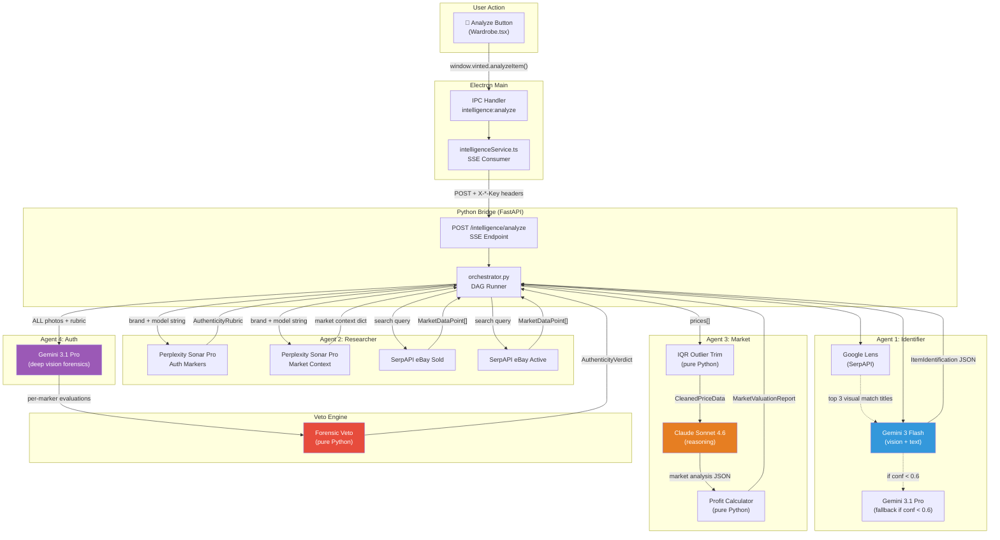
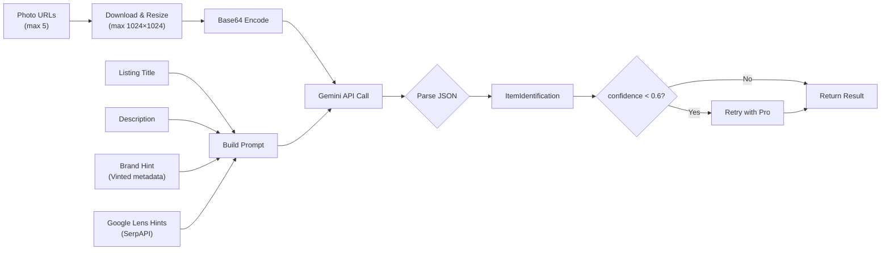
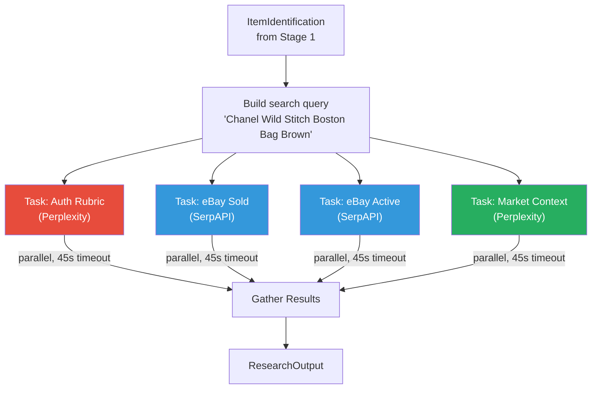
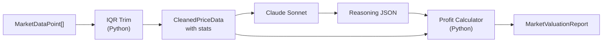
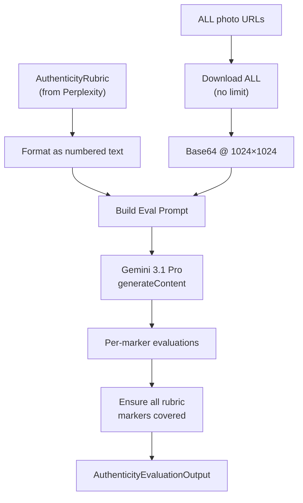
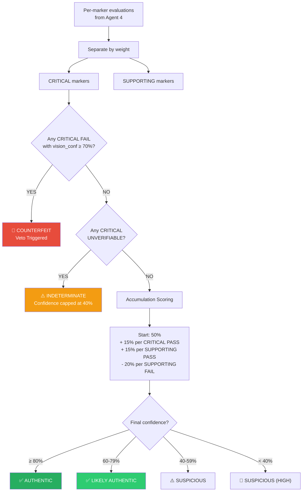

# Item Intelligence Pipeline — Deep Dive Analysis

## Executive Summary

The pipeline is a **5-stage DAG** (Directed Acyclic Graph) that cascades data from identification → research → analysis → verdict. Each agent receives the output of the previous one and adds its own layer.

> [!WARNING]
> **Known Gap**: The current auth check relies **too heavily on the rubric** (text from Perplexity) and **does not independently use the images for identification confirmation**. Agent 4 only evaluates markers it's been told to look for — it doesn't perform free-form visual analysis. See [Improvements](#identified-gaps--improvements) below.

---

## Architecture Overview



---

## Stage-by-Stage Detail

### Stage 1: Item Identification (`identifier.py`)

**Models**: `gemini-3-flash-preview` → fallback `gemini-3.1-pro-preview`



#### What actually happens:
1. **Google Lens** (optional): Takes the **first** photo URL, sends to SerpAPI's Google Lens engine. Returns the top 3 visual match titles (e.g. "Chanel Classic Flap Bag Black Caviar"). These are **text-only hints**, not used for visual comparison.
2. **Image prep**: Downloads up to **5 photos** (not all), resizes to max 1024×1024 via Pillow, base64 encodes each.
3. **Prompt construction**: Combines title + description + brand hint + category hint + Lens hints into a structured prompt asking for JSON extraction of: brand, model, sub_model, colorway, size, material, condition, category, gender, retail price estimate, confidence.
4. **Gemini Flash call**: Sends images + prompt with `temperature: 0.1` and `responseMimeType: application/json`.
5. **Fallback**: If returned `confidence < 0.6`, re-runs with the Pro model (same prompt, same images).

#### What data is passed to Stage 2:
```
ItemIdentification {
  brand: "Chanel"
  model: "Wild Stitch Boston Bag"
  colorway: "Brown"
  material: "Caviar Leather"
  size: "40cm"
  condition: "Good"
  category: "Bags"
  confidence: 0.85
  google_lens_hints: ["Chanel Boston Bag (Vestiaire)", ...]
}
```

---

### Stage 2: Research (`researcher.py`)

**Models**: Perplexity Sonar Pro + SerpAPI (no Gemini)



#### The Rubric — How It's Generated (`perplexity.py → search_auth_markers`)

This is the most critical part for authenticity. Perplexity Sonar Pro is asked:

> "What are the key authenticity markers for a **Chanel Wild Stitch Boston Bag**? Include both critical and supporting markers that can be verified from photos."

The system prompt instructs it to return structured JSON with:
- **CRITICAL markers**: Things that definitively prove/disprove (serial number, hardware engravings, specific stitching)
- **SUPPORTING markers**: Secondary indicators (dust bag, box quality, leather texture)

For each marker, it includes:
- `authentic_tells`: ["list of what authentic looks like"]
- `counterfeit_tells`: ["list of what fakes look like"]

**Example rubric output** (what Perplexity generates):
```json
{
  "markers": [
    {
      "name": "Serial Number Sticker",
      "weight": "CRITICAL",
      "description": "Chanel bags have a serial number sticker inside",
      "authentic_tells": ["Raised font", "Gold borders", "Matches authenticity card"],
      "counterfeit_tells": ["Flat printed text", "Peeling easily", "Wrong format"]
    },
    {
      "name": "CC Lock Hardware",
      "weight": "CRITICAL",
      "description": "The interlocking CC turn-lock closure",
      "authentic_tells": ["Smooth rotation", "Precise alignment", "Weight to it"],
      "counterfeit_tells": ["Rough edges", "Misaligned CCs", "Lightweight feel"]
    },
    {
      "name": "Stitching Pattern",
      "weight": "SUPPORTING",
      "description": "Even, consistent diamond-pattern stitching",
      "authentic_tells": ["10-11 stitches per inch", "Clean backstitching"],
      "counterfeit_tells": ["Uneven spacing", "Loose threads"]
    }
  ]
}
```

> [!IMPORTANT]
> **Key limitation**: This rubric is **entirely LLM-generated from Perplexity's web knowledge**. It's not a curated authentication database. The quality varies by brand/model — well-known items (Chanel Classic Flap) get excellent rubrics, while obscure items may get generic ones.

#### eBay Data (`serpapi.py`):
- **Sold listings**: Searches `ebay.co.uk` with `LH_Sold=1&LH_Complete=1` filter. Parses up to 30 results with price, condition, sold date, URL.
- **Active listings**: Same search without the sold filter. Up to 20 results.
- Prices are parsed from various formats (£143.65, ranges, etc.) into `MarketDataPoint` objects.

#### What data is passed forward:
```
ResearchOutput {
  market_data: [30+ MarketDataPoints with prices]
  authenticity_rubric: AuthenticityRubric (6-10 markers)
  search_queries_used: ["Chanel Wild Stitch Boston Bag Brown"]
  platforms_searched: ["ebay_sold", "ebay_active"]
}
```

---

### Stage 3: Market Valuation (`market_analyst.py`)

**Models**: Claude Sonnet 4.6 + deterministic Python math



1. **IQR Trimming** (pure Python): Separates prices into sold vs listed, removes outliers via interquartile range, calculates stats (min, max, p25, median, p75, mean, std dev).
2. **Claude Sonnet**: Receives the cleaned stats + the listing price. Returns: price_position (Below/At/Above Market), percentile, market velocity, reasoning.
3. **Profit Calculator** (pure Python — NOT Claude): Deterministic math for Vinted (5% fee), eBay (12.8% + £0.30), Vestiaire (15%). Calculates net revenue, profit, margin, ROI per platform.

---

### Stage 4: Auth Analysis (`auth_analyst.py`)

**Model**: `gemini-3.1-pro-preview` (deep vision)



#### What the model actually sees:
- **ALL listing photos** (no cap — unlike Stage 1 which uses max 5)
- Each resized to max 1024×1024
- The formatted rubric with every marker's name, weight, description, authentic tells, and counterfeit tells

#### What the model is asked to do:
For **each rubric marker**, evaluate the photos and return:
- `result`: **PASS** / **FAIL** / **UNVERIFIABLE**
- `observation`: What it specifically sees
- `vision_confidence`: 0.0–1.0
- `image_index`: Which photo is most relevant

#### Critical constraint:
> The model does NOT calculate any overall verdict. It only evaluates individual markers. The Veto Engine (pure Python) determines the final verdict.

---

### Stage 5: Forensic Veto Engine (`veto.py`)

**Model**: None — pure Python math



#### Three deterministic rules:
| Rule | Trigger | Result |
|------|---------|--------|
| **THE VETO** | Any CRITICAL marker FAILS with ≥70% vision confidence | → **Counterfeit** immediately |
| **THE CEILING** | Any CRITICAL marker is UNVERIFIABLE | → **Indeterminate**, confidence capped at 40% |
| **ACCUMULATION** | All criticals pass | Score = 50% + boosts - penalties → mapped to verdict |

---

## Identified Gaps & Improvements

### 1. 🔴 Agent 4 does NOT use images for independent identification

**Current**: Agent 4 receives the rubric and checks photos against it. It trusts Agent 1's identification completely.

**Problem**: If Agent 1 misidentifies the item (says "Chanel" when it's actually "Zara"), Agent 4 will evaluate "Chanel markers" against a Zara bag and likely return many UNVERIFIABLE results — not FAIL. The user gets "Indeterminate" instead of "this isn't even Chanel."

**Fix needed**: Agent 4 should **independently verify the brand/model identification** from the photos before evaluating markers. If its visual assessment disagrees with Agent 1, that should be flagged.

### 2. 🟡 Google Lens results are text-only, not visual comparison

**Current**: Lens returns title strings like "Chanel Boston Bag (Vestiaire)". These are fed as text hints to the prompt.

**Improvement**: The visual match images from Lens should be **shown alongside the listing photos** to Gemini, enabling direct visual comparison ("does this listing photo match this known-authentic reference image?").

### 3. 🟡 Rubric quality is inconsistent

The rubric depends entirely on Perplexity's web knowledge. For well-documented brands (Chanel, Louis Vuitton, Gucci), the rubric is detailed and accurate. For niche or new brands, it may be generic or incomplete.

### 4. 🟡 Only 5 images sent to Agent 1, but ALL sent to Agent 4

This asymmetry means Agent 1 (which determines what the item IS) sees fewer photos than Agent 4 (which checks if it's real). The most critical identification step is working with less data.

### 5. 🟡 Model display labels in orchestrator.py are stale

The `models_used` list appends hardcoded strings like `"gemini-3.0-flash"` that don't match the actual model IDs being used in API calls.
