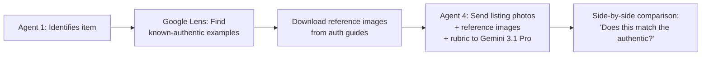

# Pipeline Improvement Plan — Answers & Proposals

---

## Stage 1: Identifier — Your Questions

### Q1: "All photos must be downloaded — non-negotiable"

**Current**: Only 5 photos are downloaded (`photo_urls[:5]`).

**Fix**: Remove the cap. Send ALL listing photos. Gemini 3 Flash and 3.1 Pro both support up to **3,000 images per prompt** with a 1M token context. Even 20 photos at 1024×1024 is well within limits.

---

### Q2: "Why is SerpAPI used at Stage 1? Isn't it Gemini's job to analyse the image?"

**You're right.** SerpAPI Google Lens at Stage 1 is a crutch that adds latency and cost without providing real value:

| What Lens does | Why it's weak |
|---|---|
| Takes the **first** photo only | Ignores all other angles |
| Returns **text titles** like "Chanel Boston Bag (Vestiaire)" | No visual comparison, just scraped page titles |
| Feeds these as **text hints** to Gemini | Gemini already sees the actual photos — text hints are redundant |

**Proposal**: Remove Google Lens from Stage 1. Gemini 3 Flash/Pro can identify items directly from photos — that's literally what it was built for. Google Lens should instead be repurposed at **Stage 4** for fetching reference images of authenticated items for visual comparison (see Stage 4 improvements below).

---

### Q3: "What determines the confidence score?"

**Currently**: The confidence score is **self-assessed by Gemini** as part of its JSON output. The prompt says:

> "confidence: 0.0 to 1.0 — the confidence score should reflect how certain you are of the brand+model identification"

**Problem**: This is entirely subjective. The model decides its own confidence with no external validation. A hallucinating model will report high confidence.

**Improvement**: Validate confidence with objective signals:
1. **Cross-reference** Gemini's identification against Google Lens visual matches — if they agree, boost confidence; if they disagree, lower it
2. **Check specificity** — if the model returns a specific sub-model + colorway + size, confidence should be higher than if it just returns "Chanel Bag"
3. **Use a second model** as a validator — have Claude or a second Gemini call independently confirm the identification

---

### Q4: "Should 3.1 Pro be the default instead of Flash?"

**Research finding**: Gemini 3.1 Pro has deeper reasoning and is recommended for "high-stakes visual tasks" where "error margins are minimal." Flash is optimised for speed/cost.

**For YOUR use case** (authenticating items worth £100-£5000+ where a wrong identification cascades through the entire pipeline), **3.1 Pro should be the default**. A wrong identification at Stage 1 makes every subsequent stage worthless.

**Proposal**:
- **Default**: `gemini-3.1-pro-preview` for identification
- **Speed mode** (optional): `gemini-3-flash-preview` for bulk scanning where speed > accuracy
- Remove the "fallback if <0.6" pattern — just use Pro directly

---

## Stage 2: Research — Your Questions

### Q1: "Does running auth + market together degrade results?"

**Current**: Auth rubric and market data run as **parallel async tasks** — they don't share context or interfere with each other. The Perplexity auth call and the SerpAPI eBay calls are completely independent HTTP requests.

**However**: The search query used is the **same string** for both purposes. For auth, you'd want: "How to authenticate a Chanel Wild Stitch Boston Bag." For market, you'd want: "Chanel Wild Stitch Boston Bag UK resale price sold." These are different intents that benefit from different queries.

**Proposal**: Use **dedicated, purpose-specific queries** even though they run in parallel.

---

### Q2: "Can images/videos from source websites be used?"

**Current**: Perplexity is text-only via API. It can't see or return images from its sources.

**Improvement path**:
1. **Extract reference image URLs from Perplexity's citations** — parse the cited authentication guide URLs, then programmatically fetch images from those pages
2. **Use Google Lens/Image Search to find reference images** of confirmed authentic examples 
3. **Feed these reference images alongside listing photos to Agent 4** — enabling direct visual comparison ("Does the listed item's hardware look like this known-authentic reference?")

---

### Q3: "How does Perplexity determine confidence in markers?"

Perplexity uses a multi-stage RAG (Retrieval-Augmented Generation) pipeline:

1. **Real-time web search** — searches the live internet, not training data
2. **Citation Gauntlet** — filters candidates on: semantic relevance, freshness, structural quality, authority, engagement signals
3. **Cross-verification** — cross-references across multiple authoritative domains to build consensus  
4. **Constrained synthesis** — forces the model to only use pre-verified evidence

**What we're NOT doing**: We're not using `search_context_size` or **domain filtering** to restrict Perplexity to trusted authentication sources (Entrupy, RealAuthentication, Lollipuff, ThePurseQueen, etc). Adding these filters would dramatically improve rubric quality.

---

### Q4: "How can Perplexity know the sub-model without visual comparison?"

**It can't reliably.** Perplexity gets the sub-model name from Agent 1's text identification (e.g. "Chanel Wild Stitch Boston Bag"). If Agent 1 identified the wrong sub-model, Perplexity creates a rubric for the **wrong item**.

**This is the cascading failure problem**:

```
Wrong identification → Wrong rubric → "UNVERIFIABLE" markers → "Indeterminate" verdict
```

**Fix**: Stage 2 should include an **independent visual identification step** — use Google Lens visual matches to cross-validate Agent 1's identification before creating the rubric.

---

### Q5: "Does Perplexity scrutinise inaccurate data?"

Perplexity's Citation Gauntlet filters for authority and cross-references across domains. But it's not infallible — if multiple inaccurate sources agree, it will propagate the error.

**Improvement**:
- **Restrict to trusted domains** via the `search_domain_filter` parameter (if available) or system prompt (`"Only use information from established authentication resources..."`)
- **Use `sonar-deep-research` instead of `sonar-pro`** — it performs hundreds of searches agenetically and does multi-step verification. More expensive but dramatically more thorough.

---

### Q6: "Shouldn't auth and market research run separately rather than shared?"

**Current**: They already run as separate parallel tasks, but share the same async function and search query builder.

**Proposal**: Split into **fully independent pipelines** that can run separately or in parallel:

| Auth Pipeline | Market Pipeline |
|---|---|
| Perplexity `sonar-deep-research` with auth-specific prompt | Perplexity `sonar-pro` with pricing-specific prompt |
| Domain-filtered to auth guides | SerpAPI eBay sold + active |
| Returns rubric + reference image URLs | Returns price data + market context |
| Uses auth-optimised search query | Uses market-optimised search query |

Both pipelines share Agent 1's identification but execute independently with their own purpose-specific queries and models.

---

## Stage 4: Auth Analyst — Your Questions

### Q1: "All photos must be used"

**Current**: `auth_analyst.py` already downloads ALL photos (no cap). The `_prepare_images()` function iterates over the full `photo_urls` list.

This is **already working correctly** — good news. The cap is only in Stage 1 (which we'll fix).

---

### Q2: "Google must do visual comparison against confirmed authentic examples"

**This is the biggest missing piece.** Currently, Agent 4 only compares photos against a **text rubric**. It reads "authentic CC lock has precise alignment" and tries to evaluate — but it has no visual reference of what "precise alignment" actually looks like.

**Proposal — Reference Image Injection**:



1. After identification, use Google Lens (or Perplexity citations) to find images from **trusted authentication sites** showing the same model
2. Download 3-5 reference images of confirmed authentic examples
3. Send BOTH the listing photos AND the reference images to Gemini 3.1 Pro
4. Update the prompt: "Here are photos of a confirmed authentic {item}. Compare them against the listing photos and evaluate each marker."

This transforms the analysis from "evaluate against a text description" to "visually compare against known-authentic examples" — a completely different level of forensic capability.

---

## Stale Model IDs Found

| File | Current ID | Latest ID | Impact |
|---|---|---|---|
| `market_analyst.py` | `claude-sonnet-4-20250514` | **`claude-sonnet-4-6`** | Using 10-month-old Claude model |
| `orchestrator.py` display | `claude-sonnet-4.6` | Correct label, wrong API ID | Display is fine, API call uses old model |

---

## Summary: All Improvements Ranked by Impact

| # | Improvement | Impact | Effort |
|---|---|---|---|
| 1 | **Use ALL photos at Stage 1** (remove `[:5]` cap) | 🔴 Critical | Trivial |
| 2 | **Default to Gemini 3.1 Pro at Stage 1** | 🔴 Critical | Trivial |
| 3 | **Inject reference images into Agent 4** for visual comparison | 🔴 Critical | Medium |
| 4 | **Remove Google Lens from Stage 1**, repurpose at Stage 4 | 🟡 High | Low |
| 5 | **Use `sonar-deep-research` for auth rubric** | 🟡 High | Low |
| 6 | **Add domain filtering** to Perplexity auth queries | 🟡 High | Low |
| 7 | **Split research into independent auth/market pipelines** | 🟡 High | Medium |
| 8 | **Cross-validate identification** with Google Lens at Stage 2 | 🟡 High | Medium |
| 9 | **Update Claude model** to `claude-sonnet-4-6` | 🟢 Low risk | Trivial |
| 10 | **Add objective confidence validation** at Stage 1 | 🟢 Medium | Medium |
| 11 | **Use purpose-specific search queries** for auth vs market | 🟢 Medium | Low |

> [!IMPORTANT]
> Items 1-3 are the most critical — they address fundamental accuracy issues. Everything else is optimisation.
