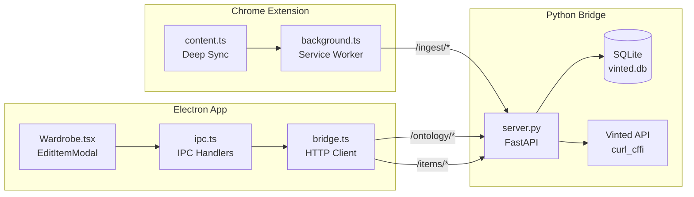

# Edit Modal System: Complete Technical Rundown

## Architecture Overview



The edit modal's fields are populated from **three distinct data sources**:

| Source | Fields | Timing |
|--------|--------|--------|
| **Local SQLite** (item row) | title, description, price, status_id, category_id, brand_id, size_id, color_ids, etc. | Immediate on modal open |
| **Deep Sync cache** (vinted_ontology table) | Material options, size options | Cached by extension; read on modal open |
| **Live Vinted API** (via Python bridge) | Package sizes, conditions, brands, models, colours | Fetched on-demand when modal opens |

---

## Field-by-Field Breakdown

### 1. Photos
| Aspect | Detail |
|--------|--------|
| **State** | `photoPlanItems: PhotoPlanItem[]` — union of `{type:'existing', id, url}` and `{type:'new', path}` |
| **Source** | `item.photo_urls` (remote) or `item.local_image_paths` (local files) |
| **UI** | Thumbnail grid with ←/→ reorder and ✕ remove buttons; "Add photos" file picker |
| **Save** | `photo_urls` array + `retained_photo_ids` + `__photo_plan` metadata sent to backend |
| **Note** | Photo editing disabled until existing photo IDs are resolved from Vinted's API (`hasUnresolvedExistingPhotoIds`) |

### 2. Title
| Aspect | Detail |
|--------|--------|
| **State** | `title: string` |
| **Source** | `item.title` → Deep Sync extracts from `itemEditModel.title` (with DOM fallback for RSC `$` references) |
| **UI** | Text input, required |

### 3. Description
| Aspect | Detail |
|--------|--------|
| **State** | `description: string` |
| **Source** | `item.description` → Deep Sync has DOM fallback via `textarea[name="description"]` |
| **UI** | Textarea, 5 rows |

### 4. Category
| Aspect | Detail |
|--------|--------|
| **State** | `selectedCategoryId: number`, `allCategories: OntologyEntity[]` |
| **Source** | Categories from `getOntology('category')` → SQLite `vinted_ontology` table (entity_type='category'); item's category from `item.category_id` (Deep Sync: `itemEditModel.catalogId`) |
| **UI** | [HierarchicalCategorySelect](file:///Users/finlaysalisbury/Desktop/Software%20Development/Antigravity/Seller-HQ/electron-app/src/components/Wardrobe.tsx#1076-1147) — breadcrumb drill-down component |
| **Cascade** | Changing category re-triggers fetches for: sizes, materials, package sizes, conditions, brands |

### 5. Brand
| Aspect | Detail |
|--------|--------|
| **State** | `selectedBrandId`, `selectedBrandName`, `brandResults: SelectOption[]` |
| **Source** | `item.brand_id` / `item.brand_name`; popular brands fetched via [searchBrands('', categoryId)](file:///Users/finlaysalisbury/Desktop/Software%20Development/Antigravity/Seller-HQ/electron-app/src/main/bridge.ts#474-490) |
| **UI** | [SearchableSelect](file:///Users/finlaysalisbury/Desktop/Software%20Development/Antigravity/Seller-HQ/electron-app/src/components/Wardrobe.tsx#901-1073) with live search via `wardrobe:searchBrands` → Python bridge → `POST /api/v2/brands` |
| **Cascade** | Changing brand triggers model fetch if category has [model](file:///Users/finlaysalisbury/Desktop/Software%20Development/Antigravity/Seller-HQ/electron-app/python-bridge/server.py#506-534) field, and material re-fetch |

### 6. Condition
| Aspect | Detail |
|--------|--------|
| **State** | `selectedStatusId: number`, `conditionOptions: {id, title}[]` |
| **Source** | `item.status_id`; options from `getConditions(categoryId)` → Python bridge → Vinted API; fallback: `FALLBACK_CONDITIONS` hardcoded array |
| **UI** | Standard `<select>` dropdown |

### 7. Size
| Aspect | Detail |
|--------|--------|
| **State** | `selectedSizeId: number`, `sizeOptions: {id, title}[]` |
| **Source** | `item.size_id`; options from `getSizes(categoryId)` → Python bridge → checks SQLite cache first (populated by Deep Sync `FETCH_SIZES_MAIN_WORLD`), falls back to Vinted API |
| **UI** | `<select>` dropdown; conditionally hidden when `sizeOptions.length === 0` or `availableFields` doesn't include `'size'` |
| **Reverse lookup** | If `domSize` exists (scraped text label) and `selectedSizeId` is 0, reverse-matches against fetched options |

### 8. Colours
| Aspect | Detail |
|--------|--------|
| **State** | `selectedColorIds: number[]`, `allColors: OntologyEntity[]` |
| **Source** | `item.color_ids` (array); full colour list from `getOntology('color')` → SQLite ontology table |
| **UI** | [SearchableSelect](file:///Users/finlaysalisbury/Desktop/Software%20Development/Antigravity/Seller-HQ/electron-app/src/components/Wardrobe.tsx#901-1073) multi-select (max 2) with colour hex swatch |
| **Save guard** | If `selectedColorIds` is empty, falls back to `item.color_ids` to prevent accidental clearing |

### 9. Materials
| Aspect | Detail |
|--------|--------|
| **State** | `selectedMaterialIds: number[]`, `materialOptions: {id, title}[]` |
| **Source** | Item's current materials from `item.item_attributes[code='material'].ids`; full options from `getMaterials(categoryId)` → Python bridge → SQLite cache (populated by Deep Sync `FETCH_ATTRIBUTES_MAIN_WORLD`) |
| **UI** | [SearchableSelect](file:///Users/finlaysalisbury/Desktop/Software%20Development/Antigravity/Seller-HQ/electron-app/src/components/Wardrobe.tsx#901-1073) multi-select (max 3); conditionally hidden when no options AND no pre-selected materials |
| **Parser** | [extractFromAttributes()](file:///Users/finlaysalisbury/Desktop/Software%20Development/Antigravity/Seller-HQ/electron-app/src/components/Wardrobe.tsx#1191-1266) handles nested `configuration.options` with grouped and flat structures |
| **Reverse lookup** | If `domMaterials` exists (scraped text), reverse-matches names against fetched options |

### 10. Model / Collection (Luxury brands)
| Aspect | Detail |
|--------|--------|
| **State** | `selectedCollectionId`, `selectedModelId`, `modelOptions` (hierarchical: collection → model children) |
| **Source** | `getModels(categoryId, brandId)` → Python bridge → Vinted API; only fetched when `availableFields.includes('model')` |
| **UI** | Two-column grid: Collection dropdown → Model dropdown (cascaded, disabled until collection selected) |
| **Auto-resolve** | If model_id exists but collection_id is missing, auto-resolves collection from parent |

### 11. ISBN (Books)
| Aspect | Detail |
|--------|--------|
| **State** | `isbn: string` |
| **Source** | `item.isbn` (from Deep Sync: `itemEditModel.isbn`) |
| **UI** | Text input; conditionally shown when `availableFields.includes('isbn')` or item already has an ISBN |

### 12. Measurements
| Aspect | Detail |
|--------|--------|
| **State** | `measurementLength`, `measurementWidth` (strings → parsed to float on save) |
| **Source** | `item.measurement_length`, `item.measurement_width` |
| **UI** | Two number inputs (cm, step 0.1); conditionally shown when `availableFields` includes both measurement fields |

### 13. Dynamic Niche Attributes
| Aspect | Detail |
|--------|--------|
| **State** | `nicheAttributes: NicheAttribute[]`, `nicheValues: Record<string, number\|number[]\|string>` |
| **Source** | Extracted from `getMaterials()` response — any attribute code NOT in `coreFields` set with a non-null `configuration` |
| **UI** | Dynamically rendered: single-select `<select>` or multi-select [SearchableSelect](file:///Users/finlaysalisbury/Desktop/Software%20Development/Antigravity/Seller-HQ/electron-app/src/components/Wardrobe.tsx#901-1073) depending on `selectionType`; text input if no options |
| **Examples** | `video_game_platform`, `video_game_rating`, custom category-specific fields |

### 14. Price
| Aspect | Detail |
|--------|--------|
| **State** | `price: string` |
| **Source** | `item.price` (Deep Sync: extracted from `itemEditModel.price` with DOM fallback from `input[name="price"]`) |
| **UI** | Number input with currency label |

### 15. Package Size
| Aspect | Detail |
|--------|--------|
| **State** | `packageSizeId: number`, `packageSizeOptions: {id, title}[]` |
| **Source** | `item.package_size_id`; options from `getPackageSizes(categoryId, vintedItemId)` → Python bridge → Vinted API |
| **UI** | Button group (pill selection), with recommended size auto-selected |
| **Fallback** | If API fails, shows hardcoded `Small / Medium / Large` |

### 16. Unisex Toggle
| Aspect | Detail |
|--------|--------|
| **State** | `isUnisex: boolean` |
| **Source** | `item.is_unisex` |
| **UI** | iOS-style toggle switch; conditionally shown when `availableFields` includes `'unisex'` |

---

## Data Lifecycle

### Deep Sync → SQLite → Modal

```
1. User clicks "Sync with Extension" button in modal
   → window.vinted.openExternal('https://vinted.co.uk/items/{id}/edit?hq_sync=true')

2. Chrome Extension content.ts detects ?hq_sync=true
   → Extracts itemEditModel from RSC script tags (34 fields)
   → Sends FETCH_ATTRIBUTES_MAIN_WORLD to background SW
   → Sends FETCH_SIZES_MAIN_WORLD to background SW
   → POSTs item data to /ingest/item
   → POSTs attributes to /ingest/materials  
   → POSTs sizes to /ingest/sizes

3. Modal waits 4 seconds, then calls reloadItem()
   → Reads fresh data from SQLite via getWardrobeItem(id)
   → Re-fetches materials, sizes, etc. from cache

4. Ontology useEffects fire
   → getMaterials() reads from SQLite cache → full schema with labels
   → getSizes() reads from SQLite cache → full size list
   → getPackageSizes() calls Vinted API directly
   → getConditions() calls Vinted API directly
```

### Modal Save → Vinted API

```
1. User clicks "Save Changes"
   → handleSubmit() builds payload (25+ fields)
   → Calls onSave(payload)

2. Parent component's save handler
   → wardrobe:saveItem IPC → bridge.ts → POST /items/{vinted_item_id}
   → Python bridge forwards to Vinted API with photos, attributes, etc.
   → Updates local SQLite row

3. For live Vinted items: assisted edit via content script
   → Opens edit page → puppeteers dropdown selections
   → selectCondition(), selectSize(), selectPackageSize()
```

---

## Remaining Development Gaps

### 🔴 Critical (Blocking full automation)

| Gap | Impact | Notes |
|-----|--------|-------|
| **First-open cache miss** | Materials/sizes empty on first modal open before Deep Sync completes | The 4-second timeout is fragile. Could be fixed by having the Deep Sync send a completion event that triggers [reloadItem()](file:///Users/finlaysalisbury/Desktop/Software%20Development/Antigravity/Seller-HQ/electron-app/src/components/Wardrobe.tsx#1356-1396) instead of a fixed delay. |
| **Photo ID resolution** | Cannot reorder/add photos until existing photo IDs are loaded from Vinted | Currently requires `getItemDetail()` to fetch photo IDs from Vinted's API, which is Datadome-gated. When this fails, photo editing is completely locked. |
| **Save to Vinted API** | The save payload is assembled but the actual `POST /items/{id}` to Vinted's API may fail due to Datadome | Currently relies on the Python bridge, which faces the same Datadome truncation as the materials endpoint. The assisted edit puppeteering workaround handles condition/size/packageSize but not materials, photos, or description changes. |

### 🟡 Medium (Feature gaps)

| Gap | Impact | Notes |
|-----|--------|-------|
| **Assisted edit doesn't puppeteer materials** | When editing on Vinted directly, materials are not set via the dropdown puppeteering | [selectCondition()](file:///Users/finlaysalisbury/Desktop/Software%20Development/Antigravity/Seller-HQ/extension/src/content.ts#216-223), [selectSize()](file:///Users/finlaysalisbury/Desktop/Software%20Development/Antigravity/Seller-HQ/extension/src/content.ts#182-189), [selectPackageSize()](file:///Users/finlaysalisbury/Desktop/Software%20Development/Antigravity/Seller-HQ/extension/src/content.ts#190-197) exist but no `selectMaterial()` |
| **No drag-and-drop photos** | UI explicitly says "Drag-and-drop not supported yet" | Would need Electron IPC for file drop handling |
| **Category change doesn't clear incompatible fields** | Changing from Shoes → Video Games still shows stale size options until re-fetch completes | Small UX issue — could flash loading state during transition |
| **Niche attribute values not pre-populated** | Dynamic niche attributes (e.g. `video_game_platform`) show as empty even when the item has existing values | The `nicheValues` record is initialized empty; existing values from `item_attributes` are not seeded |

### 🟢 Minor (Polish)

| Gap | Impact | Notes |
|-----|--------|-------|
| **No validation feedback** | No inline validation for required fields before save | Currently only shows save error after backend rejection |
| **Brand search debounce** | Live brand search fires on every keystroke | Could benefit from a 300ms debounce |
| **Condition fallback** | Hardcoded `FALLBACK_CONDITIONS` may not match all locales | Currently UK-specific |
| **DOM-scraped values unused for some fields** | `domColours`, `domParcelSize` are declared but inconsistently used | The reverse-lookup only works when the API options have loaded |
