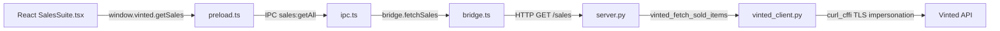

# Sales Suite — Implementation Walkthrough

## Overview

Added a complete "Sales Suite" tab to Vinted HQ that fetches and displays the user's sold items through the stealth Python Bridge, with full-width glass cards and action buttons.

## Data Flow

## Files Changed

### Python Bridge Layer

| File | Change |
|------|--------|
| [vinted_client.py](file:///Users/finlaysalisbury/Desktop/Software%20Development/Antigravity/Vinted-HQ/electron-app/python-bridge/vinted_client.py) | Added `fetch_sold_items()` — GET `/api/v2/users/{user_id}/items/sold` with `curl_cffi` stealth |
| [server.py](file:///Users/finlaysalisbury/Desktop/Software%20Development/Antigravity/Vinted-HQ/electron-app/python-bridge/server.py) | Added `GET /sales` FastAPI route with Datadome challenge detection |

### Electron Main Process

| File | Change |
|------|--------|
| [bridge.ts](file:///Users/finlaysalisbury/Desktop/Software%20Development/Antigravity/Vinted-HQ/electron-app/src/main/bridge.ts) | Added `fetchSales()` method |
| [ipc.ts](file:///Users/finlaysalisbury/Desktop/Software%20Development/Antigravity/Vinted-HQ/electron-app/src/main/ipc.ts) | Added `sales:getAll` IPC handler |

### Preload & Types

| File | Change |
|------|--------|
| [preload.ts](file:///Users/finlaysalisbury/Desktop/Software%20Development/Antigravity/Vinted-HQ/electron-app/src/preload.ts) | Added `getSales()` context bridge binding |
| [global.d.ts](file:///Users/finlaysalisbury/Desktop/Software%20Development/Antigravity/Vinted-HQ/electron-app/src/types/global.d.ts) | Added `VintedSoldItem` type + `getSales` on `Window.vinted` |

### React Renderer

| File | Change |
|------|--------|
| [SalesSuite.tsx](file:///Users/finlaysalisbury/Desktop/Software%20Development/Antigravity/Vinted-HQ/electron-app/src/components/SalesSuite.tsx) | **New** — Full card-based dashboard component |
| [App.tsx](file:///Users/finlaysalisbury/Desktop/Software%20Development/Antigravity/Vinted-HQ/electron-app/src/App.tsx) | Added `sales` tab with $ icon to sidebar |

## Key Design Decisions

- **No Tailwind** — Uses the existing inline `CSSProperties` from `theme.ts` for consistency
- **Stealth first** — All API calls go through Python Bridge's `curl_cffi` with JA3 spoofing
- **Datadome detection** — Errors surfaced as a red banner with retry button, not crashes
- **Flexible parsing** — `SalesSuite.tsx` handles both `{ items: [...] }` and raw array responses from Vinted

## Verification

- **TypeScript compilation**: `npx tsc --noEmit` — zero new errors (all existing errors are pre-existing in `Wardrobe.tsx`, `checkoutService.ts`, etc.)
