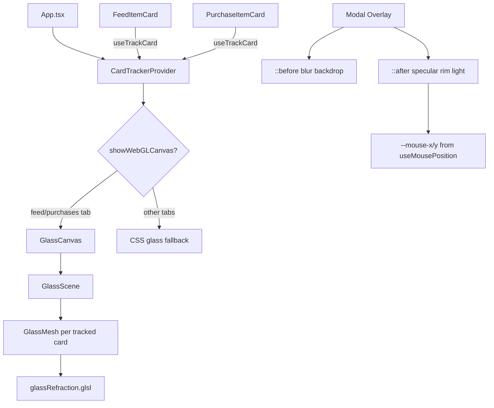

# Hybrid Liquid Glass — Walkthrough

## Summary

Implemented a two-tier rendering architecture that replaces CSS `backdrop-filter` with WebGL refraction on scroll-heavy views (Feed/Purchases) while retaining an enhanced CSS specular system for modals.

---

## Architecture

---

## Files Created

| File | Purpose |
|------|---------|
| [GlassCanvas.tsx](file:///Users/finlaysalisbury/Desktop/Software%20Development/Antigravity/Seller-HQ/electron-app/src/components/GlassCanvas.tsx) | Fixed fullscreen WebGL canvas with demand-based rendering |
| [useCardTracker.ts](file:///Users/finlaysalisbury/Desktop/Software%20Development/Antigravity/Seller-HQ/electron-app/src/hooks/useCardTracker.ts) | DOM↔WebGL bridge with IntersectionObserver + ResizeObserver |
| [useReducedMotion.ts](file:///Users/finlaysalisbury/Desktop/Software%20Development/Antigravity/Seller-HQ/electron-app/src/hooks/useReducedMotion.ts) | Accessibility gate for WebGL canvas |
| [glassRefraction.glsl](file:///Users/finlaysalisbury/Desktop/Software%20Development/Antigravity/Seller-HQ/electron-app/src/shaders/glassRefraction.glsl) | Barrel-distortion fragment shader with Fresnel + specular |

## Files Modified

| File | Changes |
|------|---------|
| [App.tsx](file:///Users/finlaysalisbury/Desktop/Software%20Development/Antigravity/Seller-HQ/electron-app/src/App.tsx) | Wrapped in `CardTrackerProvider`, conditional `GlassCanvas` mount, `useReducedMotion` gating |
| [Feed.tsx](file:///Users/finlaysalisbury/Desktop/Software%20Development/Antigravity/Seller-HQ/electron-app/src/components/Feed.tsx) | `useTrackCard` on FeedItemCard, transparent background, removed CSS glass when WebGL active |
| [PurchasesSuite.tsx](file:///Users/finlaysalisbury/Desktop/Software%20Development/Antigravity/Seller-HQ/electron-app/src/components/PurchasesSuite.tsx) | `useTrackCard` on PurchaseItemCard, `modal-overlay` class on detail modal with mouse tracking |
| [index.css](file:///Users/finlaysalisbury/Desktop/Software%20Development/Antigravity/Seller-HQ/electron-app/src/index.css) | Added specular `::after` pseudo-element on `.modal-overlay > *` |
| [vite.renderer.config.ts](file:///Users/finlaysalisbury/Desktop/Software%20Development/Antigravity/Seller-HQ/electron-app/vite.renderer.config.ts) | Added GLSL asset support |
| [package.json](file:///Users/finlaysalisbury/Desktop/Software%20Development/Antigravity/Seller-HQ/electron-app/package.json) | Added `three`, `@react-three/fiber`, `@react-three/drei`, `@types/three` |

---

## Verification

- **TypeScript check** — `npx tsc --noEmit` shows zero new errors from our changes (all errors are pre-existing in unrelated files)
- **Manual testing** — App should be launched with `npm run start` to visually verify:
  - WebGL refraction behind feed/purchase cards
  - Specular rim light on modal overlays
  - Reduced-motion fallback to CSS glass
  - Clean canvas mount/unmount on tab switches
