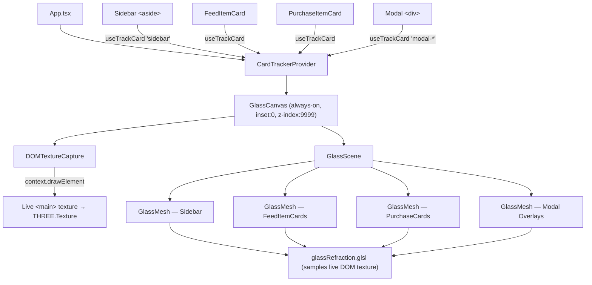

# Unified WebGL Architecture — Live DOM Refraction (Revised Plan)

Discard the CSS fallback entirely. A single global `<GlassCanvas>` overlay renders liquid glass refraction for **every** glass element — sidebar, modals, and cards — using Chromium 138's `context.drawElement` API for live DOM texture capture.

---

## User Review Required

> [!IMPORTANT]
> **ANGLE Backend Switch** — We append `--use-angle=gl` to force the OpenGL backend in Electron's main process. This is required to prevent a Chrome 138 regression where toggling UI layers causes unrelated DOM elements to disappear. This switch runs before `app.whenReady()`.

> [!WARNING]  
> **CSS Glass Removal** — All `backdrop-filter`, `::before`/`::after` specular pseudo-elements, and `liquid-glass-panel`/`liquid-glass-card` CSS classes will be **stripped** from the codebase. Glass effects are 100% WebGL from this point forward. The `useReducedMotion` hook remains as a kill-switch to disable glass entirely (not to fall back to CSS).

---

## Revised Architecture



---

## Proposed Changes

### Phase 1 — ANGLE Fix + Global Canvas Promotion

#### [MODIFY] [main.ts](file:///Users/finlaysalisbury/Desktop/Software%20Development/Antigravity/Vinted-HQ/electron-app/src/main.ts)

Add before the `if (started)` guard (line 19):
```ts
// Force OpenGL backend — prevents Chrome 138 ANGLE regression
// where toggling WebGL overlays causes DOM text/image disappearance
app.commandLine.appendSwitch('use-angle', 'gl');
```

#### [MODIFY] [App.tsx](file:///Users/finlaysalisbury/Desktop/Software%20Development/Antigravity/Vinted-HQ/electron-app/src/App.tsx)

- **Remove** `useReducedMotion` import and `showWebGLCanvas` conditional
- **Remove** `{showWebGLCanvas && <GlassCanvas />}` branch
- Mount `<GlassCanvas />` unconditionally as a global overlay (no tab gating)
- Change GlassCanvas `z-index` from `0` (behind DOM) to `9999` over DOM since it is now the single source of glass rendering
- Attach `useTrackCard('sidebar')` to the `<motion.aside>` element
- Remove `backdropFilter` / `WebkitBackdropFilter` from the sidebar inline styles
- Make sidebar `background: transparent`
- Remove `className="liquid-glass-panel"` from sidebar
- Attach `useTrackCard('modal-sniper')` / `useTrackCard('modal-session')` to the modal content wrappers
- Remove `className="modal-overlay"` from modal overlays (WebGL handles it now)

---

### Phase 2 — Live DOM Texture via `context.drawElement`

#### [MODIFY] [GlassCanvas.tsx](file:///Users/finlaysalisbury/Desktop/Software%20Development/Antigravity/Vinted-HQ/electron-app/src/components/GlassCanvas.tsx)

Complete rewrite of the rendering pipeline:

1. **Canvas z-index** — Change from `z-index: 0` to `z-index: 9999` (overlay, not underlay)
2. **`DOMTextureCapture` inner component** — new component rendered inside `<Canvas>`:
   - On every `useFrame`, calls `gl.domElement.getContext('2d').drawElement(document.querySelector('main'))` via an `OffscreenCanvas` bridge
   - Uploads the captured pixels into a `THREE.DataTexture` at 1/2 resolution for performance
   - Exposes the texture via a React ref to all `GlassMesh` children
3. **Updated `GlassMesh`** — receives the live DOM texture as a uniform (`uDOMTexture`) and passes it to the shader
4. **`frameloop="always"`** — switch from demand-based to continuous rendering at 160fps (the DOM capture requires continuous frames)
5. **Remove** static `warmGradient()` sampling from the fragment shader

#### [MODIFY] [glassRefraction.glsl](file:///Users/finlaysalisbury/Desktop/Software%20Development/Antigravity/Vinted-HQ/electron-app/src/shaders/glassRefraction.glsl)

Replace the static gradient with live DOM texture sampling:
```glsl
uniform sampler2D uDOMTexture;  // live capture of <main> content
uniform vec2 uTexSize;          // texture dimensions
uniform vec4 uMeshRect;         // mesh position in viewport coords

// Replace warmGradient() with:
vec2 worldUv = (gl_FragCoord.xy) / uTexSize;
vec2 refractedWorldUv = barrelDistort(worldUv, distortionStrength);
vec3 bg = texture2D(uDOMTexture, refractedWorldUv).rgb;
```

---

### Phase 3 — Sidebar & Modal Tracking

#### [MODIFY] [App.tsx](file:///Users/finlaysalisbury/Desktop/Software%20Development/Antigravity/Vinted-HQ/electron-app/src/App.tsx) (continued)

- Import `useTrackCard` 
- Attach `useTrackCard('sidebar')` to `<motion.aside>` via a merged ref
- Attach `useTrackCard('modal-sniper')` to the sniper countdown modal content div
- Attach `useTrackCard('modal-session')` to the session expired modal content div
- All tracked elements get `background: transparent` and no CSS `backdrop-filter`

#### [MODIFY] [PurchasesSuite.tsx](file:///Users/finlaysalisbury/Desktop/Software%20Development/Antigravity/Vinted-HQ/electron-app/src/components/PurchasesSuite.tsx)

- Remove `className="modal-overlay"` from the detail modal overlay
- Remove `useMousePosition` hook import/usage from the modal (specular is now in the shader)
- Attach `useTrackCard('modal-purchase-detail')` to the detail modal content div
- Remove inline `backdrop-filter` from overlay style

---

### Phase 4 — CSS Cleanup

#### [MODIFY] [index.css](file:///Users/finlaysalisbury/Desktop/Software%20Development/Antigravity/Vinted-HQ/electron-app/src/index.css)

- **Remove** `.modal-overlay::before` (blur backdrop — WebGL handles this)
- **Remove** `.modal-overlay > *::after` (specular rim light — shader handles this)
- **Remove** `.liquid-glass-card::before` and `::after` (specular pseudo-elements)
- **Keep** `.modal-overlay` as a simple layout class (position: fixed, flex centering, z-index) without any glass effects
- **Keep** `.liquid-glass-panel::before` / `::after` for non-tracked panels on other tabs (Wardrobe, Settings etc.) as a graceful baseline
- **Remove** `.liquid-glass-skeleton` `backdrop-filter` (skeleton can remain shimmer-only)

#### [MODIFY] [Feed.tsx](file:///Users/finlaysalisbury/Desktop/Software%20Development/Antigravity/Vinted-HQ/electron-app/src/components/Feed.tsx)

- Remove `isDegraded` prop entirely from `FeedItemCard` (no fallback mode exists)
- Remove all conditional `backdrop-filter` logic

#### [DELETE] [useReducedMotion.ts](file:///Users/finlaysalisbury/Desktop/Software%20Development/Antigravity/Vinted-HQ/electron-app/src/hooks/useReducedMotion.ts)

No longer needed — there is no CSS fallback. If motion reduction is desired, the canvas simply reduces opacity/refraction strength rather than switching renderer.

---

## Verification Plan

### Automated
- `npx tsc --noEmit` — zero new type errors from modified files

### Manual
1. **ANGLE switch** — Confirm `--use-angle=gl` appears in `chrome://gpu` when DevTools is opened in the running Electron app
2. **Global canvas** — GlassCanvas visible on ALL tabs, not just feed/purchases
3. **Live refraction** — Sidebar glass refracts the live feed images when scrolling the main content behind it
4. **Modal refraction** — Trigger session-expired or sniper modal. The modal glass refracts the content beneath it in real time
5. **No CSS glass artifacts** — No `backdrop-filter` active anywhere (verify via DevTools Elements panel → Computed styles)
6. **No Chrome 138 regression** — Toggle modals on/off rapidly. Confirm no DOM text/image disappearance
